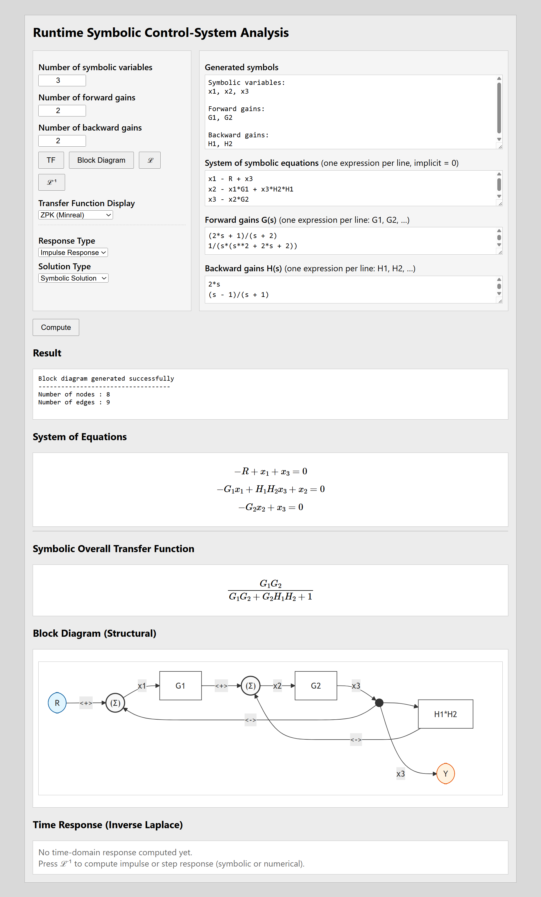
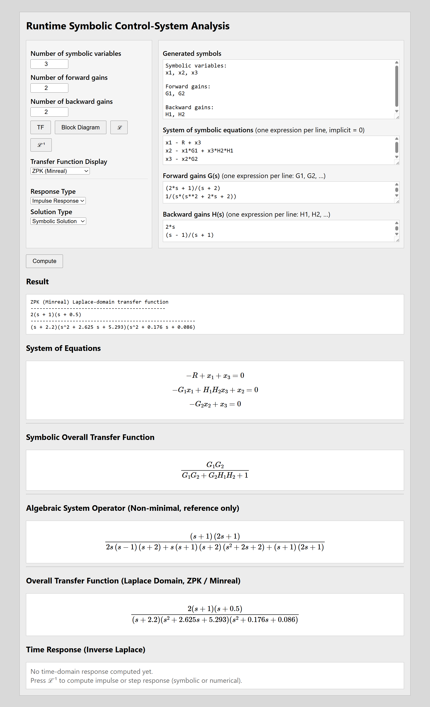
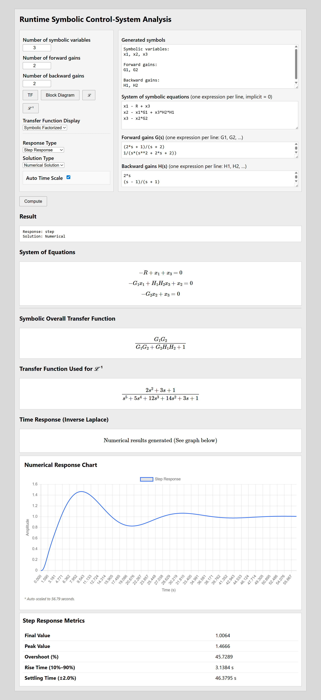

# 📘 Symbolic Transfer-Function Computation Platform

### Topology-Guided Symbolic Framework for Block-Diagram Transfer-Function Extraction, Structural Recovery, and Response Analysis


---

## ✅ Overview

This open-source Django-based platform supports symbolic transfer-function computation for block-diagram-based control systems.

The platform is designed as a research-oriented web application for implementing a topology-guided symbolic framework that connects block-diagram structure, symbolic equation construction, transfer-function extraction, structural recovery, and response analysis.

Key capabilities:

- Block-diagram-induced symbolic equation processing
- Symbolic transfer-function extraction
- Numerical transfer-function realization
- Pole-zero cancellation and minimal realization support
- Time-domain response analysis
- Modular symbolic and numerical computation engines
- Web-based runtime interface using Django

This repository provides the implementation support for the research work:

> **Topology-Guided Symbolic Framework for Block-Diagram Transfer-Function Extraction, Structural Recovery, and Response Analysis**

✅ Fully offline operation  
✅ No external APIs required  
✅ Research-friendly symbolic computation workflow  
✅ Django-based reproducible implementation  

---

## 🌐 Live Demo

A live deployment can be provided using a cloud-hosting service such as Railway, Render, or PythonAnywhere.

> Demo mode is intended for research demonstration and reproducibility testing.

Demo URL:

```text
https://your-deployment-url.example.com/
```

---

## 🏛️ System Architecture

| Module | Functionality |
|---|---|
| `runtime_symbolic_control` | Django project configuration, settings, URL routing, ASGI, and WSGI |
| `symbolic_tf_computation` | Main Django application for symbolic transfer-function computation |
| `symbolic_tf_computation/engine/control_engine.py` | Symbolic transfer-function extraction engine |
| `symbolic_tf_computation/engine/numerical_engine.py` | Numerical realization and numerical processing support |
| `symbolic_tf_computation/engine/time_response.py` | Time-domain response computation |
| `symbolic_tf_computation/engine/zpk_minreal.py` | Pole-zero cancellation and minimal realization support |
| `symbolic_tf_computation/views.py` | Runtime request handling and computational workflow orchestration |
| `symbolic_tf_computation/templates/symbolic/runtime_gui.html` | Web-based graphical user interface |

---

## 🧪 Research Context

This platform supports research on symbolic computation for control-system block diagrams.

The implementation focuses on the following computational workflow:

1. Construction of a block-diagram-induced symbolic equation system
2. Symbolic transfer-function extraction
3. Numerical realization of the extracted transfer function
4. Pole-zero cancellation and minimal realization
5. Time-domain response computation
6. Web-based visualization of computational results

The system is intended to support reproducible experimentation and validation for block-diagram-based control-system analysis.

---

## 🖥️ User Interface Overview

### ✅ Figure 1 — Runtime Symbolic Computation Interface



---

### ✅ Figure 2 — Symbolic Transfer-Function Output



---

### ✅ Figure 3 — Time-Response Analysis



---

## ✅ Features

| Category | Capability |
|---|---|
| Symbolic Computation | Derives symbolic transfer functions from induced equation systems |
| Control-System Analysis | Supports block-diagram-based transfer-function workflows |
| Numerical Realization | Converts symbolic transfer functions into numerical forms |
| Minimal Realization | Supports pole-zero cancellation and simplified realization |
| Response Analysis | Computes time-domain responses from realized transfer functions |
| Web Interface | Provides a Django-based runtime GUI |
| Deployment | Supports local execution and cloud hosting |
| Reproducibility | Organized project structure for research verification |

---

## 🚀 Quick Start: Local Installation

### ✅ Requirements

- Python 3.10+
- pip installed
- SQLite3
- Git

---

## ✅ Installation

Clone the repository:

```bash
git clone https://github.com/w-chainarong/SymblcMatthTrnsfnc-GitHubOpenSource.git
cd SymblcMatthTrnsfnc-GitHubOpenSource
```

Install dependencies:

```bash
pip install -r requirements.txt
```

Apply Django migrations:

```bash
python manage.py migrate
```

Run the development server:

```bash
python manage.py runserver
```

Open the web application:

```text
http://127.0.0.1:8000/
```

---

## 📦 Requirements

The main dependencies are listed in `requirements.txt`:

```text
Django>=5.2,<5.3
gunicorn
whitenoise
sympy
numpy
scipy
```

---

## 📁 Repository Structure

```text
SymblcMatthTrnsfnc-GitHubOpenSource/
│
├── runtime_symbolic_control/
│   ├── __init__.py
│   ├── asgi.py
│   ├── settings.py
│   ├── urls.py
│   └── wsgi.py
│
├── symbolic_tf_computation/
│   ├── engine/
│   │   ├── control_engine.py
│   │   ├── numerical_engine.py
│   │   ├── time_response.py
│   │   └── zpk_minreal.py
│   │
│   ├── migrations/
│   ├── templates/
│   │   └── symbolic/
│   │       └── runtime_gui.html
│   │
│   ├── admin.py
│   ├── apps.py
│   ├── models.py
│   ├── urls.py
│   └── views.py
│
├── docs/
│   └── images/
│       ├── runtime_gui.png
│       ├── symbolic_output.png
│       └── time_response.png
│
├── .gitignore
├── LICENSE
├── manage.py
├── README.md
└── requirements.txt
```

---

## 🔐 Environment Variables

For local development, the project includes a fallback development secret key.

For deployment or production use, set the following environment variable:

```text
DJANGO_SECRET_KEY
```

Example on Windows PowerShell:

```powershell
$env:DJANGO_SECRET_KEY="your-secure-secret-key"
```

Example on Linux/macOS:

```bash
export DJANGO_SECRET_KEY="your-secure-secret-key"
```

---

## 🗄️ Database Note

The SQLite database file is intentionally excluded from this repository:

```text
db.sqlite3
```

A new local database can be created by running:

```bash
python manage.py migrate
```

---

## 🧭 Deployment Notes

The project can be deployed on common Python/Django hosting platforms, such as:

- Railway
- Render
- PythonAnywhere
- VPS-based Linux servers

For cloud deployment, configure:

```text
DJANGO_SECRET_KEY
ALLOWED_HOSTS
DEBUG=False
```

---

## 📚 Citation

If this software supports your academic work, please cite the related research article when available:

```text
C. Wisassakwichai et al.,
"Topology-Guided Symbolic Framework for Block-Diagram Transfer-Function Extraction,
Structural Recovery, and Response Analysis,"
manuscript in preparation.
```

---

## 📄 License

This project is released under the MIT License.

See the `LICENSE` file for details.

---

## 👤 Author

**Chainarong Wisassakwichai**  
Rajamangala University of Technology Krungthep (RMUTK), Thailand  

GitHub: [w-chainarong](https://github.com/w-chainarong)